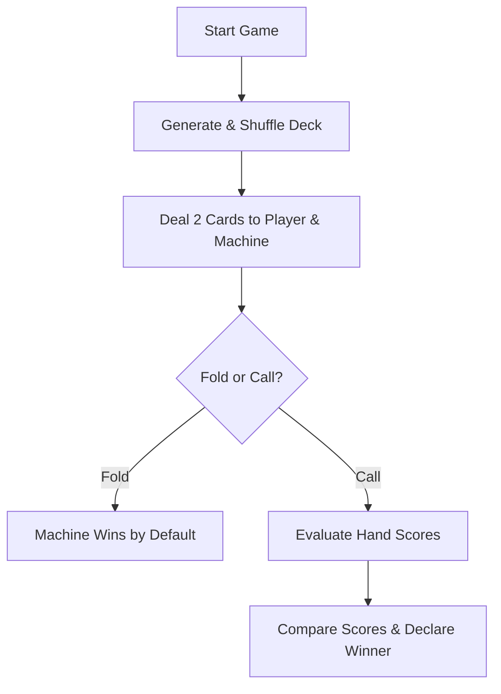

# Poker Game: Command-Line Heads-Up Showdown

A simple, console-based 2-card poker duel between a human player and a Machine opponent, written in pure Java.

## How It Works (The TL;DR)

Instead of bloated 7-card Texas Hold'em logic, this implementation gets straight to the point: a fast-paced 2-card showdown.



---

## Technical Details

### 1. Card Mapping System (`Card.java`)
A single card is represented by an integer ID from `0` to `51`. Using simple modulo arithmetic, we extract the rank and suit without needing complex objects or enums:
- **Rank**: `id % 13` (ranges from 0 to 12, mapping to `2` through `Ace`)
- **Suit**: `id / 13` (ranges from 0 to 3, mapping to `Spades`, `Hearts`, `Diamonds`, and `Clubs`)

### 2. Shuffling & Generation (`PokerLogic.java`)
The deck is initialized sequentially and shuffled in place using Java's built-in `Collections.shuffle()`, yielding a cryptographically random distribution:

```java
public List<Card> generateDeck() {
    List<Card> deck = new ArrayList<>();
    for (int i = 0; i < 52; i++) {
        deck.add(new Card(i));
    }
    Collections.shuffle(deck);
    return deck;
}
```

### 3. Showdown Score Evaluation
Since hands consist of only 2 cards:
- **Pair**: Valued at `100 + rank`.
- **High Card**: Valued at `rank`.
- **Three of a Kind**: Code exists (`200 + rank`) for future-proofing, but is impossible with a 2-card hand.

The player with the higher evaluated score wins the round.

---

## Graphical User Interface (`pokerGUI.java`)

To complement the console version, we implemented a custom JavaFX desktop interface featuring:
- **Green Felt felt background** matching standard real-world casino tables.
- **Dynamic CSS Cards**: Cards are rendered dynamically as white rectangular panels with rounded corners, top-left rank values, and central unicode suit icons (`♠`, `♥`, `♦`, `♣`) colored dynamically (black/red).
- **Face-Down Machine Cards**: Opponent cards are shown with geometric red card-backs until the showdown is initialized.
- **State-driven controls**: Buttons to Call/Fold and Deal are synchronized with the game loop to prevent out-of-order execution.

